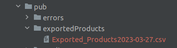

# ProductsExporter
Magento 2 module

To app/code of your magento instalation add YellowCard vendor folder, and to this add this module.

you have to create in your pub path new folder named : 

exportedProducts

in this folder will be stored all exported files with purchased products